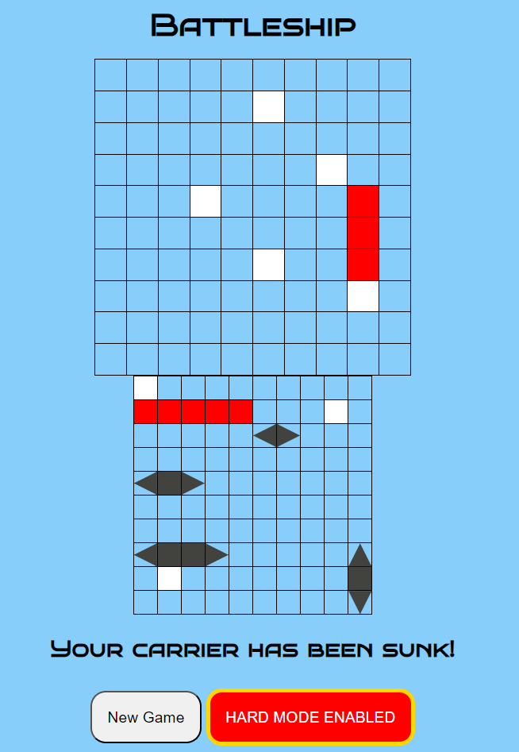

# BATTLESHIP

The game of [Battleship](https://en.wikipedia.org/wiki/Battleship_(game)) is a strategy guessing game between two players.  In this version of Battleship, you and an AI will take turns
hitting each other's board.  The first player to "sink" all of the other players' ships by hitting their corresponding squares is the winner!  

This game incorporates JavaScript, HTML, CSS, and JQuery.

## Getting Started

Click [here](https://bbonning4.github.io/battleship/) to preview the game!

To play, simply shuffle the board until you like the positions of your ships, then fire away!  Click the opponent's board to take a shot.  The square will turn white for a miss, and red for a hit!  The opponent has the same ships you do, just layed out differently.  Use that information to defeat the opponent!  Also feel free to enable hard mode by clicking the button, which will stay lit red while enabled.  On hard mode, the AI is more advanced so will take out your ships more quickly! 

Ship sizes:
Patrol boat -2
Submarine   -3
Destroyer   -3
Battleship  -4
Carrier     -5

## Next Steps

- Add option for player to build their own board
- Add a ships frame to have another visual of what ships are remaining
- Make the AI even smarter!